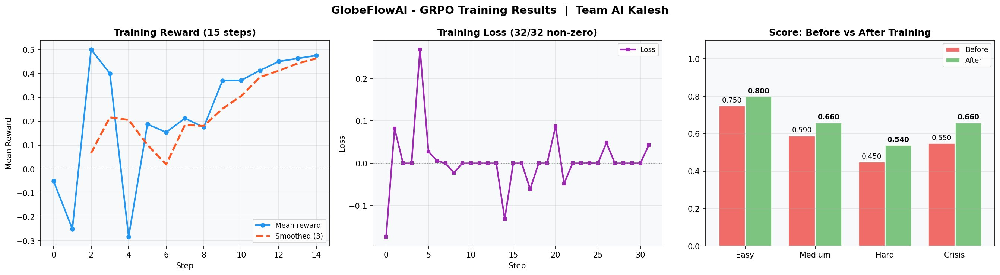

# GlobeFlowAI — Global Mobility & Compliance Orchestrator

[](https://github.com/meta-pytorch/OpenEnv)
[](https://huggingface.co/spaces/Swayam14/openenv-workforce)
[](https://python.org)
[](#)

An OpenEnv-compatible reinforcement learning environment in which an agent handles the full lifecycle of real-world employee relocation cases — processing documents, navigating multi-country compliance rules, managing department approvals, and adapting to mid-episode regulatory changes that invalidate prior work.

Built for the **Meta x Scaler OpenEnv AI Hackathon 2026** by **Team AI Kalesh**.

---

## Quick Links

- **Live HF Space:** https://huggingface.co/spaces/Swayam14/openenv-workforce
- **Source code:** https://github.com/Swayam14/openenv-workforce
- **Training notebook (Colab):** _placeholder — link to be added once the notebook is published_
- **Training results plot:** [`assets/training_results.png`](assets/training_results.png)
- **Blog post:** [`blog/globeflowai_blog.md`](blog/globeflowai_blog.md)
- **Team:** Team AI Kalesh

---

## Problem Statement

Multinational enterprises move thousands of employees across borders every year, and every relocation is a tangle of country-specific rules. The same workflow that succeeds for an engineer moving to Germany will fail for a manager moving to Singapore, and will actively penalise a director moving to the UAE. Mobility teams spend weeks chasing the right documents, sequencing department approvals, configuring payroll, and resolving cases where two countries' rules genuinely contradict each other. When regulations shift mid-process — and they do — the entire case has to be re-planned without restarting from scratch.

GlobeFlowAI compresses that workflow into a controlled OpenEnv simulation. The agent must learn the rule structure of three destination countries (Germany, Singapore, UAE), respect the ordering constraints between departments, avoid country-specific traps that look superficially correct, and recover from a mid-episode regulatory disruption. It is a long-horizon, partially observable, rule-rich enterprise workflow — exactly the kind of task that exposes the difference between an agent that has memorised a sequence and one that has internalised the underlying world model.

---

## Why This Environment Is Different

**Genuine multi-country rule conflicts.** The hard task asks the agent to relocate one employee to two countries simultaneously, where Germany requires tax-ID registration and the UAE has no income tax at all. Calling `set_tax_id` for the UAE looks like progress but is a rule violation that costs the agent both per-step reward and grader score. The agent has to learn that the right action depends on which country the action is targeted at, not just which actions exist.

**Mid-episode regulatory disruption (the crisis task).** Halfway through a Germany relocation, a regulatory event fires automatically: the Blue Card visa programme is suspended, the existing visa document is invalidated, and a new ICT-Permit document is injected into the state. The agent must detect the change, acknowledge it explicitly with a dedicated action, and re-route its remaining workflow without retrying any of the now-blocked actions. This tests long-horizon planning under non-stationary rules — a behaviour mode that single-shot tasks cannot expose.

**Dense, shaped reward with parsimony pressure.** The reward function provides gradient signal at every step, not just at episode end. Milestone bonuses fire when entire categories complete (all documents verified, all required departments approved, all compliance items configured). A parsimony penalty deducts grader score for actions outside the task-relevant set, which discourages agents from spamming the action space to brute-force their way through.

**No artificial score ceilings.** Earlier iterations of the environment used per-task ceilings to encode difficulty. The current grader removes them entirely: difficulty is encoded directly in the requirement weights, so a perfectly played episode lands at a task-appropriate score (approximately 0.95 for easy, 0.80 for medium, 0.75 for crisis, 0.65 for hard). This makes the score a clean function of agent behaviour rather than an artefact of task labelling.

---

## Architecture

```
GlobeFlowAI/
├── env/
│   ├── environment.py        # Core WorkforceEnv — reset/step/state
│   ├── models.py             # Pydantic v2 typed models
│   ├── validators.py         # Pure validation functions
│   ├── reward.py             # Shaped reward function
│   ├── tasks.py              # Task definitions (easy/medium/hard/crisis)
│   ├── rules.py              # Re-export of rules engine
│   ├── rules_engine.py       # Country rules, fixture loading
│   └── graders.py            # Shim → graders/graders.py
├── graders/
│   └── graders.py            # Deterministic task graders (no ceilings)
├── server/
│   └── app.py                # FastAPI entry point shim
├── fixtures/
│   ├── country_rules.json    # Per-country compliance rules
│   ├── visa_types.json       # Visa type metadata
│   └── tax_treaties.json     # India bilateral tax treaties
├── assets/
│   └── training_results.png  # Combined reward, loss, before/after plot
├── blog/
│   └── globeflowai_blog.md   # Hackathon writeup
├── main.py                   # FastAPI app with session management
├── inference.py              # OpenAI-powered baseline agent
├── openenv.yaml              # OpenEnv spec metadata (v2.0.0)
├── pyproject.toml            # Project metadata
├── Dockerfile                # Container definition
└── requirements.txt          # Python dependencies
```

---

## State Design

The environment maintains a stateful `WorkforceState` exposed through Pydantic v2 typed models. Beyond the standard mobility fields, the state tracks the regulatory event lifecycle so the crisis task is fully introspectable.

| Field | Type | Description |
|-------|------|-------------|
| `case_id` | str | Unique case identifier |
| `task_name` | str | One of `easy`, `medium`, `hard`, `crisis` |
| `employee` | EmployeeRecord | Role and dependent status |
| `countries` | list[str] | Destination countries (1–2) |
| `documents` | dict | Document name to status and validity flag |
| `departments` | dict | HR / Legal / Finance approval flags |
| `compliance` | dict | tax_id / payroll / pdpa / shadow_payroll |
| `conflicts` | list | Active rule conflicts (hard task) |
| `deadline_days` | int | Steps remaining before auto-fail |
| `progress` | float | Weighted completion fraction in [0.0, 1.0] |
| `status` | str | `in_progress` / `success` / `failed` |
| `regulatory_event_fired` | bool | Crisis event has been triggered |
| `regulatory_event_acknowledged` | bool | Agent has called `acknowledge_regulatory_change` |
| `regulatory_event` | dict | Event metadata (title, invalidated doc, replacement doc) |
| `regulatory_event_step` | int | Step number at which the crisis event fires |

---

## Action Space

The action space contains twelve action types. Most actions take an empty target string; document and country-specific actions take a meaningful target.

| Action Type | Target | Description |
|-------------|--------|-------------|
| `request_document` | document name | Submit a document for verification |
| `verify_document` | document name | Verify a submitted document |
| `approve_hr` | *(empty)* | HR department approval |
| `approve_legal` | *(empty)* | Legal approval (requires all docs verified) |
| `approve_finance` | *(empty)* | Finance approval (requires Legal and no unresolved conflicts) |
| `set_payroll` | country | Configure host-country payroll |
| `set_tax_id` | country | Register tax ID (Germany only — not UAE, not Singapore) |
| `set_shadow_payroll` | country | Enable shadow payroll (Singapore only) |
| `set_pdpa` | country | Collect PDPA consent (Singapore only) |
| `resolve_conflict` | *(empty)* | Resolve a rule conflict (hard task) |
| `acknowledge_regulatory_change` | *(empty)* | Acknowledge a fired crisis event (crisis task) |
| `finalize_case` | *(empty)* | Close the case (all blockers must be cleared) |

The valid document set spans `passport`, `visa`, `employment_letter`, `degree_certificate`, `work_permit`, `employment_pass`, `residence_permit`, `tax_form`, and `ict_permit` — the last of which is injected dynamically when the crisis event fires.

**Action format:**
```json
{"action_type": "request_document", "target": "passport"}
{"action_type": "approve_hr", "target": ""}
{"action_type": "acknowledge_regulatory_change", "target": ""}
```

---

## Observation Space

After every `reset()` and `step()`, the agent receives an `Observation` containing:

| Field | Description |
|-------|-------------|
| `state` | Full `WorkforceState` (documents, departments, compliance, conflicts, regulatory event) |
| `available_actions` | List of currently valid actions, written as `action_type:target` strings |
| `current_blockers` | Reasons `finalize_case` cannot be called yet |
| `last_action_result` | Result code of the last action (`success`, `wrong_action`, `rule_violation`, etc.) |
| `last_action_error` | Error detail if last action failed |
| `steps_taken` | Number of steps used this episode |
| `done` | `True` when episode has ended |

For the crisis task, when the regulatory event has fired but is unacknowledged, `acknowledge_regulatory_change` is surfaced at the top of `available_actions` so a well-prompted agent has every signal it needs to detect the disruption.

---

## Tasks

The environment exposes four tasks of increasing difficulty. The maximum step budget is 35 (raised from 25 to accommodate the crisis task's 35-day deadline).

### Task 1 — Easy: India to Germany

| Property | Value |
|----------|-------|
| Countries | Germany |
| Employee | Engineer, no dependents |
| Documents required | passport, visa, employment_letter, work_permit |
| Departments required | HR only |
| Compliance required | tax_id, payroll |
| Deadline | 20 steps |
| Perfect score | approximately 0.95 |

**Optimal sequence (~11 steps):** `request + verify (x4 docs) -> approve_hr -> set_tax_id -> set_payroll -> finalize_case`

### Task 2 — Medium: India to Singapore

| Property | Value |
|----------|-------|
| Countries | Singapore |
| Employee | Manager, has dependents |
| Documents required | passport, visa, employment_letter |
| Departments required | HR, Legal |
| Compliance required | payroll, pdpa, shadow_payroll |
| Deadline | 25 steps |
| Perfect score | approximately 0.80 |

Singapore does not require `tax_id` — calling it is a rule violation. PDPA consent and shadow payroll are mandatory, and Legal must approve before finalization. **Optimal sequence (~12 steps):** `request + verify (x3 docs) -> approve_hr -> approve_legal -> set_payroll -> set_pdpa -> set_shadow_payroll -> finalize_case`

### Task 3 — Hard: India to Germany + UAE (multi-country)

| Property | Value |
|----------|-------|
| Countries | Germany, UAE |
| Employee | Director, has dependents |
| Documents required | passport, visa, employment_letter, work_permit |
| Departments required | HR, Legal, Finance |
| Compliance required | tax_id (Germany only), payroll |
| Deadline | 30 steps |
| Perfect score | approximately 0.65 |

> **Critical trap:** The UAE has no income tax. Calling `set_tax_id` with target `UAE` triggers a per-step penalty of -0.30 and a grader-score deduction of -0.25. The agent must call `set_tax_id` for Germany only.

A `tax_conflict` is pre-loaded into state and must be cleared with `resolve_conflict` before Finance will approve. **Optimal sequence (~14 steps):** `request + verify (x4 docs) -> approve_hr -> approve_legal -> set_tax_id (Germany) -> set_payroll -> resolve_conflict -> approve_finance -> finalize_case`

### Task 4 — Crisis: India to Germany with mid-episode regulatory disruption

| Property | Value |
|----------|-------|
| Countries | Germany |
| Employee | Manager, no dependents |
| Documents required | passport, employment_letter, work_permit, **ict_permit** |
| Departments required | HR, Legal |
| Compliance required | tax_id, payroll |
| Deadline | 35 steps |
| Event step | 8 |
| Perfect score | approximately 0.75 |

The crisis task begins as a normal Germany relocation. At step 8, a regulatory event fires automatically: the Blue Card visa programme is suspended, the existing visa document is marked invalid, and a new `ict_permit` document is injected into state. The agent must (a) call `acknowledge_regulatory_change` to clear the event, (b) request and verify the new `ict_permit`, and (c) avoid any further action targeting the invalidated visa. Each post-event attempt to use the visa costs -0.30 per step and -0.20 in the grader.

**Optimal sequence (~15 steps):** Normal flow for 7 steps -> event fires -> `acknowledge_regulatory_change` -> `request_document:ict_permit` -> `verify_document:ict_permit` -> `approve_legal` -> `set_tax_id` -> `set_payroll` -> `finalize_case`

This task is the load-bearing test of long-horizon adaptation. An agent that has merely memorised the easy-task sequence will continue trying to verify the now-invalid visa and burn through penalty after penalty.

---

## Reward Function

The reward function is dense and shaped throughout the episode. Per-step rewards are clamped to `[-1.0, 1.0]`; the cumulative episode reward is clamped to `[0.0, 1.0]`.

| Event | Reward |
|-------|--------|
| Successful action | +0.30 |
| Documents milestone (all verified) | +0.20 bonus |
| Departments milestone (all required approved) | +0.20 bonus |
| Compliance milestone (all required configured) | +0.15 bonus |
| Conflict resolved | +0.25 bonus |
| Episode finalized successfully | +0.50 bonus |
| Progress increase | +0.5 x delta-progress (capped at +0.20) |
| Wrong action (valid type, wrong context) | -0.10 |
| Repeated action | -0.10 |
| Prerequisite violated | -0.20 |
| Rule violation (e.g. UAE tax, post-event visa use) | -0.30 |
| Invalid action (unknown type or target) | -0.30 |

Progress is computed as a weighted combination of documents (38%), departments (32%), compliance (15%), conflict resolution (8%), and crisis acknowledgement (7%) — so the agent receives gradient signal even when it never reaches `finalize_case`.

---

## Grader System

Each task has a deterministic grader that returns a score strictly in `(0.0, 1.0)` — the OpenEnv validator requires exclusive bounds. The current grader has **no per-task ceilings**: difficulty is encoded directly in the requirement weights, so a perfect episode lands at a task-appropriate score.

### Easy grader (perfect approximately 0.95)
| Component | Weight |
|-----------|--------|
| Documents verified (4 x 0.10) | 0.40 |
| HR approved | 0.20 |
| tax_id | 0.15 |
| payroll | 0.15 |
| Finalized | 0.05 |

### Medium grader (perfect approximately 0.80)
| Component | Weight |
|-----------|--------|
| Documents verified (3 x 0.08) | 0.24 |
| HR approved | 0.12 |
| Legal approved | 0.14 |
| payroll | 0.08 |
| pdpa | 0.08 |
| shadow_payroll | 0.08 |
| Finalized | 0.06 |

### Hard grader (perfect approximately 0.65)
| Component | Weight |
|-----------|--------|
| Documents verified (4 x 0.05) | 0.20 |
| HR approved | 0.06 |
| Legal approved | 0.08 |
| Finance approved | 0.08 |
| tax_id | 0.05 |
| payroll | 0.05 |
| Conflict resolved | 0.08 |
| Finalized | 0.05 |
| **Penalty:** UAE tax violation | -0.25 |

### Crisis grader (perfect approximately 0.75)
| Component | Weight |
|-----------|--------|
| Documents verified (4 x 0.08, includes ict_permit) | 0.32 |
| HR approved | 0.08 |
| Legal approved | 0.10 |
| tax_id | 0.08 |
| payroll | 0.07 |
| Regulatory event handled (fired and acknowledged) | 0.05 |
| Finalized | 0.05 |
| **Penalty:** visa use after event | -0.20 per occurrence |

### Parsimony penalty (all tasks)
Actions outside the task-relevant set incur -0.03 each, capped at -0.15 per episode. System event markers (e.g. `[SYSTEM_EVENT:DE-VISA-SUSPENSION-2024]`) are excluded from this count. This applies a soft pressure toward clean, on-policy behaviour.

---

## Country Rules Summary

| Rule | Germany | Singapore | UAE |
|------|---------|-----------|-----|
| Visa required | Yes | Yes | Yes |
| Tax ID required | Yes | No | No (no income tax) |
| Payroll required | Yes | Yes | Yes |
| PDPA consent | No | Yes | No |
| Shadow payroll | No | Yes | No |
| Finance approval | No | No | Yes |
| Tax treaty with India | DTAA 2011 | DTAA 1994 | DTAA 1992 |

---

## HTTP API

The environment runs as a FastAPI server on port 7860.

| Method | Endpoint | Description |
|--------|----------|-------------|
| GET | `/` | Health check — returns `{"status": "ok"}` |
| GET | `/health` | Health check (explicit) |
| GET | `/tasks` | List available tasks |
| POST | `/reset` | Start new episode `{"task_name": "easy"}` |
| POST | `/step` | Apply action `{"action_type": "...", "target": "..."}` |
| GET | `/state` | Current state (query param `?session_id=...`) |
| POST | `/grade` | Get current grader score |

```bash
# Reset to the crisis task
curl -X POST http://localhost:7860/reset \
  -H "Content-Type: application/json" \
  -d '{"task_name": "crisis"}'

# Submit an action
curl -X POST http://localhost:7860/step \
  -H "Content-Type: application/json" \
  -d '{"action_type": "request_document", "target": "passport"}'

# Get current grader score
curl -X POST http://localhost:7860/grade \
  -H "Content-Type: application/json" \
  -d '{}'
```

---

## Training

The agent is trained with **Group Relative Policy Optimization (GRPO)** via Hugging Face TRL, using a LoRA adapter on top of a small open-weights base model. The full training pipeline runs end-to-end in approximately 12 minutes on a single T4 GPU.

### Configuration

| Component | Value |
|-----------|-------|
| Base model | `Qwen/Qwen2.5-1.5B-Instruct` |
| Method | GRPO (TRL) + LoRA (PEFT) |
| LoRA rank / alpha / dropout | 16 / 32 / 0.05 |
| LoRA target modules | `q_proj`, `k_proj`, `v_proj`, `o_proj` |
| Learning rate | 1e-4 |
| KL coefficient (beta) | 0.001 |
| Generations per step | 4 |
| Batch size / gradient accumulation | 1 / 4 |
| Epochs | 2 |
| Precision | fp16 |
| Generation max new tokens | 64 |
| Training temperature / top-p | 1.2 / 0.92 |
| Time budget | 12 minutes (hard stop) |

### Reward function used during training

The training reward calls the live environment for every completion and combines three signals:

1. **Real per-step reward** from the environment.
2. **Progress delta**, weighted at 2x to amplify forward motion.
3. **Final score** from the grader, added when an episode terminates inside the rollout.

Outputs are clipped to `[-0.5, 0.5]` to stabilise GRPO. Completions parsed as invalid receive -0.3, and actions absent from `available_actions` receive -0.5. This keeps the policy on-distribution without requiring trainer-side reward shaping.

### Training data

The dataset contains 16 prompts: 4 prompts per task across all four tasks (easy, medium, hard, crisis). Half of the prompts within each task are taken at episode start; the other half pre-advance the environment by 8 steps so the model also trains on near-completion states. This is what teaches the policy when to call `finalize_case`.

### Results



| Curve | Observation |
|-------|-------------|
| Training reward (15 logged steps) | Mean reward climbs from -0.05 at step 0 to approximately +0.48 at step 14, with the smoothed trace showing steady improvement after step 6. |
| Training loss (32/32 non-zero steps) | Loss oscillates near zero with a few sharp spikes — expected behaviour for a policy-gradient method at this scale. |
| Score: before vs after | Improvement on every task; largest absolute gains on the hardest tasks. |

### Before vs after evaluation

Evaluation uses temperature 0.3 and `enforce_available=True`, with a single rollout per task. Baseline scores are pre-training measurements of the same Qwen2.5-1.5B-Instruct model on the same tasks.

| Task | Before | After | Delta |
|------|--------|-------|-------|
| Easy | 0.750 | 0.800 | +0.050 |
| Medium | 0.590 | 0.660 | +0.070 |
| Hard | 0.450 | 0.540 | +0.090 |
| Crisis | 0.550 | 0.660 | +0.110 |
| **Average** | **0.585** | **0.665** | **+0.080** |

The largest absolute lifts are on the hard task (+0.090) and the crisis task (+0.110) — the two tasks that carry the most rule structure and require the most adaptive behaviour. This is consistent with the design intent of the environment: dense per-step reward and shaped progress signal give a small base model usable gradient on tasks where pattern matching alone fails.

### Limitations

- Single-rollout evaluation per task; multi-seed evaluation with variance bars is planned.
- The 12-minute training budget is intentionally tight for reproducibility on free-tier Colab; longer training and a larger base model would likely widen the lifts further.

---

## Setup and Usage

### Prerequisites

- Python 3.11+
- Docker (for containerised deployment)
- OpenAI-compatible API key (for the baseline inference agent)

### Local installation

```bash
git clone https://github.com/Swayam14/openenv-workforce
cd openenv-workforce

pip install -r requirements.txt

# Environment variables for the baseline agent
export HF_TOKEN=your_openai_api_key
export API_BASE_URL=https://api.openai.com/v1
export MODEL_NAME=gpt-4o-mini

# Start the server
uvicorn main:app --host 0.0.0.0 --port 7860
```

### Run the baseline agent

```bash
python inference.py
```

### Run tests

```bash
python test_eval.py
```

### Docker

```bash
docker build -t globeflowai .

docker run -p 7860:7860 \
  -e HF_TOKEN=your_openai_api_key \
  -e API_BASE_URL=https://api.openai.com/v1 \
  -e MODEL_NAME=gpt-4o-mini \
  globeflowai
```

---

## OpenEnv Spec Compliance

- `reset()` returns a typed `Observation`.
- `step(action)` returns a typed `StepResult` with `observation`, `reward`, `done`, and `info`.
- `state()` returns a typed `WorkforceState`.
- Pydantic v2 typed models are used throughout.
- `openenv.yaml` v2.0.0 contains the full task registry (easy, medium, hard, crisis).
- The Dockerfile builds and runs cleanly.
- The FastAPI server listens on port 7860.
- The `/health` endpoint responds for HuggingFace Space liveness checks.
- All grader scores are strictly between 0 and 1 (exclusive bounds, asserted at runtime).
- `inference.py` uses the OpenAI client with `API_BASE_URL`, `MODEL_NAME`, and `HF_TOKEN`.
- Stdout logging follows the `[START]` / `[STEP]` / `[END]` format.

---

## Themes

This environment aligns with the following hackathon themes.

**Primary**

- **Theme 3.1 — World Modeling (Professional Tasks):** the environment encodes a real enterprise workflow with country-specific rules, prerequisite chains, and rule conflicts.
- **Theme 2 — Long-Horizon Planning and Instruction Following:** the crisis task explicitly tests the agent's ability to detect and recover from non-stationary rules mid-episode.

**Bonus alignment**

- **Scaler AI Labs** — multi-app RL environment for enterprise workflows.
- **Scale AI** — long-horizon workflows for HR and IT.

---

## Team

**Team AI Kalesh** — built for the Meta x Scaler OpenEnv AI Hackathon, India 2026.

---

## License

This project is licensed under the MIT License.